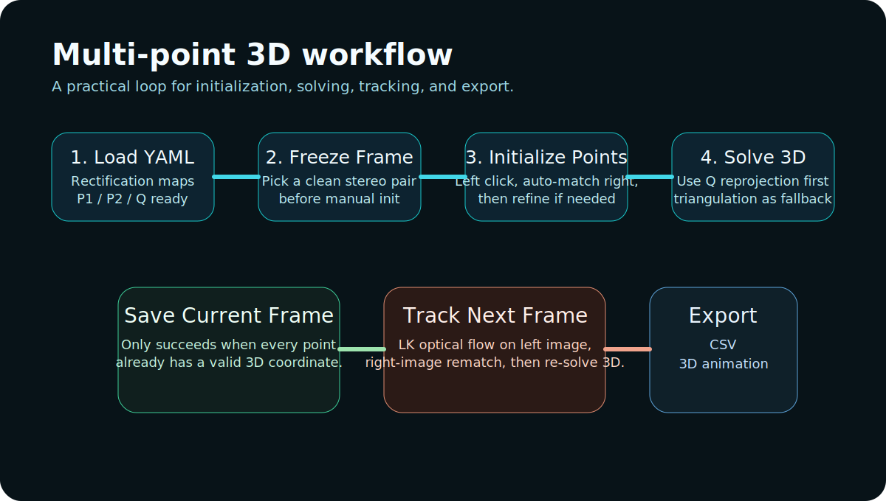

# Stereo Vision Studio

A desktop stereo-vision workbench for camera preview, stereo calibration, single-frame 3D distance measurement, and multi-point 3D tracking.


## What This Project Does

Stereo Vision Studio is a PyQt desktop application built around OpenCV-based stereo workflows. It is designed for engineering experiments where you need to:

- preview and record stereo video,
- calibrate a stereo rig from chessboard footage,
- validate calibration with manual point-to-point 3D measurement,
- initialize and track multiple feature points across frames,
- export reconstructed 3D point series to CSV or animation.

This repository is intentionally code-first and data-light: source code and documentation are tracked, while local recordings, point clouds, and calibration outputs stay on your machine.

## Current Pages

### 1. Live Preview
- Open the stereo camera stream.
- Split side-by-side frames into left and right views.
- Record experiment videos.
- Save manual snapshots for quick inspection.

### 2. Stereo Calibration
- Load a recorded chessboard video.
- Scan candidate frame pairs.
- Filter and select usable calibration pairs.
- Run stereo calibration and export YAML parameters.

### 3. Two-Point 3D Measurement
- Load a stereo calibration YAML.
- Open a recorded video.
- Freeze a clean rectified frame.
- Click `A_left -> A_right -> B_left -> B_right`.
- Compute the 3D distance between two reconstructed points.

### 4. Multi-Point 3D Measurement
- Load a stereo calibration YAML.
- Freeze the first frame and initialize multiple feature points.
- Auto-match right-image correspondences.
- Save a fully solved 3D frame.
- Track points to the next frame using LK optical flow on the left image.
- Re-solve 3D points and export CSV / 3D animation.



## Data Policy

The following artifacts are **not** meant to be uploaded to the remote repository:

- recorded videos in `record/`
- generated point clouds in `ply/`
- local stereo calibration YAML outputs in `yaml/`
- exported CSV files and derived experiment assets

The repo now keeps these paths ignored by default while preserving the folder structure with `.gitkeep` files.

## Recommended Workflow

### Calibration workflow
1. Record a stable chessboard video.
2. Open `Stereo Calibration`.
3. Scan corner pairs and review the accepted frames.
4. Run calibration and save the YAML file locally.
5. Validate the calibration with the `Two-Point 3D Measurement` page before entering longer tracking sessions.

### Multi-point workflow
1. Load a valid stereo YAML.
2. Open a recorded video and freeze a sharp frame.
3. Set the point count.
4. Initialize points on the left image, then refine on the right image.
5. Save the frame only after every point has a valid 3D solution.
6. Run `Track Next Frame`, then manually review low-confidence points.
7. Export CSV or 3D animation after collecting complete solved frames.

## 3D Solving Notes

The multi-point page now follows a more explicit solving path:

- 3D coordinates are solved per point, not only at export time.
- The page first tries rectified reprojection through the YAML `Q` matrix.
- If `Q`-based reprojection is unavailable or invalid, it falls back to `cv2.triangulatePoints`.
- Saving a frame now reports which points are still unresolved and why.

Typical reasons a point is still unsolved:
- the left point was not set,
- the right point was not set,
- disparity is too small or negative,
- the triangulation result is invalid.

## Project Structure

- `main.py`: application entry and global Qt setup
- `ui_theme.py`: shared dark control-room style theme
- `preview_record_tab.py`: preview / recording page
- `calib_tab.py`: stereo calibration page
- `rectify_tab.py`: two-point measurement page
- `perception_3d_tab.py`: multi-point 3D page
- `record.py`: camera capture / recording backend
- `utils_img.py`: frame splitting helpers
- `utils_common.py`: matrix loading and pixmap helpers
- `config.py`: local directory and split configuration

## Environment

Recommended environment:

- Python 3.9+
- OpenCV
- NumPy
- PyQt5
- optional: `matplotlib` for 3D animation export

Install example:

```bash
pip install opencv-python numpy pyqt5 matplotlib
```

## Run

```bash
python main.py
```

If your local environment uses a dedicated interpreter, run that interpreter directly instead.

## What Can Be Improved Next

These are the highest-value next steps for the current project:

1. Unify split configuration usage across all pages.
Currently `rectify_tab.py` and parts of `calib_tab.py` still use fixed split values instead of reading the same runtime split parameters everywhere.

2. Persist the latest YAML / video selections.
Reopening the app should restore the last-used calibration file, video file, point count, and display FPS.

3. Add stronger calibration diagnostics.
Examples: per-pair reprojection error summary, baseline / RMS dashboard, and a quick calibration health panel before measurement.

4. Add per-point quality visualization for multi-point tracking.
Examples: vertical disparity warning colors, confidence threshold highlighting, and a side panel that lists unresolved points live.

5. Add a project-session export manifest.
A small JSON manifest could capture YAML path, video path, frame index range, point count, and export outputs for reproducibility.

## Repository Notes

This repository intentionally does **not** include experiment data. If you clone it on another machine, create or copy your own local contents under:

- `record/`
- `ply/`
- `yaml/`

The application will still create and use those folders locally.
